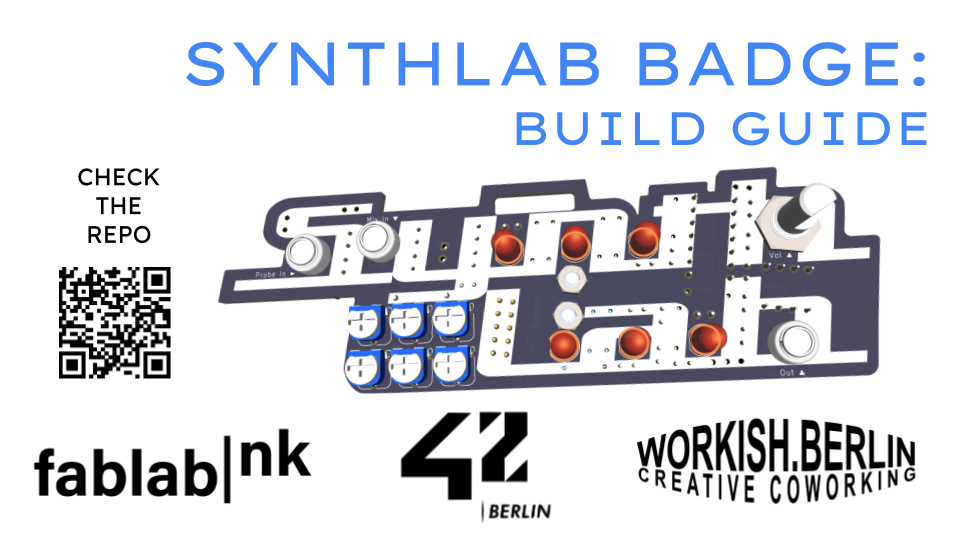

A light-to-sound badge-synth based on Dylan B's open-hardware Beam Catcher project and coming out of our weekly SynthLab audio hardware meetups at fablab|nk. The badge is designed to be a first-intro to DIY synthesiser building for new visitors. 

Check the [PDF build guide](./BuildGuide/SynthLabBadgeBuildGuide.pdf). Please refer to this as the one source of truth. If the extra info and images below help, that's a bonus!

